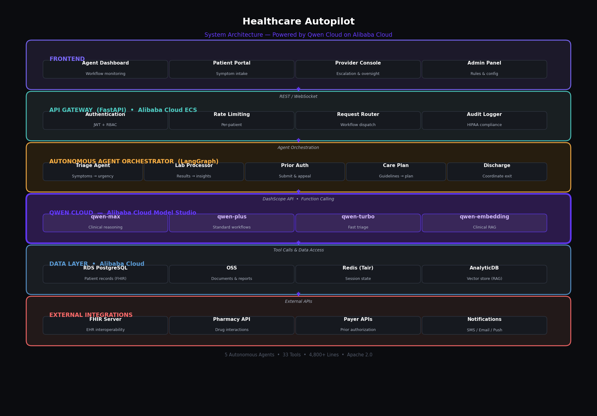

# Healthcare Autopilot 🏥

**Autonomous AI Agent for Healthcare Workflow Automation**

> Built with **Qwen Cloud** for the Global AI Hackathon

[](LICENSE)
[](https://www.alibabacloud.com)
[](https://dashscope.aliyuncs.com)

## 🎯 Track: Agentic AI — Autonomous Multi-Step Workflows

## Overview

Healthcare Autopilot is an autonomous AI agent system that handles complex, multi-step clinical workflows from start to finish — without human intervention for routine cases.

The system leverages **Qwen Cloud's** advanced reasoning and function-calling capabilities to orchestrate 5 complete healthcare workflows:

| Workflow | What it Does |
|----------|-------------|
| 🔄 **Patient Triage** | Symptoms → risk assessment → department routing → appointment scheduling |
| 🧪 **Lab Processing** | Results → interpretation → alerts → patient communication |
| 📄 **Prior Authorization** | Clinical evidence → payer submission → status tracking → appeals |
| 📋 **Care Plan Generation** | Diagnosis → evidence-based plan → drug checks → monitoring |
| 🏠 **Discharge Coordination** | Instructions → follow-up scheduling → medication reminders |

## 🏗️ Architecture



### Tech Stack

| Layer | Technology | Alibaba Cloud Service |
|-------|-----------|----------------------|
| LLM / Reasoning | Qwen-max, Qwen-plus, Qwen-turbo | Model Studio (DashScope) |
| Backend | Python FastAPI | ECS |
| Database | PostgreSQL (FHIR R4) | RDS |
| Object Storage | Documents & reports | OSS |
| Vector DB | Clinical knowledge RAG | AnalyticDB |
| Cache | Workflow state | Redis (Tair) |
| Monitoring | Logs & metrics | CloudMonitor + SLS |

## 🚀 Quick Start

### Prerequisites
- Python 3.11+
- Docker (optional)
- Alibaba Cloud DashScope API Key ([Get one here](https://dashscope.console.aliyun.com/apiKey))

### Setup

```bash
# Clone the repository
git clone https://github.com/your-username/healthcare-autopilot.git
cd healthcare-autopilot

# Install dependencies
pip install -r backend/requirements.txt

# Set environment variables
export DASHSCOPE_API_KEY="your-dashscope-api-key"

# Run the server
cd backend
uvicorn main:app --reload --port 8000
```

### Docker

```bash
docker build -t healthcare-autopilot .
docker run -e DASHSCOPE_API_KEY=$DASHSCOPE_API_KEY -p 8000:8000 healthcare-autopilot
```

### Test the Triage Agent

```bash
curl -X POST http://localhost:8000/api/v1/triage \
  -H "Content-Type: application/json" \
  -d '{
    "chief_complaint": "Severe headache with nausea for 2 days",
    "symptoms": ["headache", "nausea", "light sensitivity", "neck stiffness"],
    "duration": "2 days",
    "severity": 7,
    "onset": "sudden",
    "age": 35,
    "vital_signs": {
      "heart_rate": 88,
      "blood_pressure_systolic": 145,
      "temperature": 100.4,
      "spo2": 97
    }
  }'
```

## 🧠 How It Works

### Autonomous Agent Loop

```
Patient Input → Qwen Cloud Reasoning → Tool Calls → Execute → Loop Until Done
                    ↑                                              |
                    └──────── Append results, continue ────────────┘
```

1. Patient submits symptoms via API or chat interface
2. **Qwen-max** analyzes the clinical context using its system prompt
3. Agent decides which tools to call (risk assessment, red flag check, etc.)
4. Tools execute against backend services (FHIR, scheduling, notifications)
5. Results feed back to Qwen for next decision
6. Loop continues until workflow is complete or escalation is triggered

### Model Routing Strategy

| Task Complexity | Model | Use Case |
|----------------|-------|----------|
| High | `qwen-max` | Clinical reasoning, care plans, prior auth |
| Medium | `qwen-plus` | Patient communication, summarization |
| Low | `qwen-turbo` | Simple routing, scheduling coordination |

### Safety & Escalation

- **Confidence threshold**: Agent escalates to human provider when confidence < 70%
- **Red flag detection**: Immediate escalation for emergency indicators
- **Audit trail**: Every agent decision logged with reasoning chain
- **HIPAA compliance**: Data encrypted at rest and in transit

## 📁 Project Structure

```
healthcare-autopilot/
├── backend/
│   ├── main.py                    # FastAPI application
│   ├── agents/
│   │   ├── qwen_client.py        # Qwen Cloud integration
│   │   ├── triage_agent.py       # Autonomous triage workflow
│   │   └── orchestrator.py       # Multi-agent coordinator
│   ├── config/
│   │   └── clinical_rules.yaml   # Clinical decision rules
│   └── requirements.txt
├── deployment/
│   └── alibaba-cloud/
│       └── dashscope_client.py   # ← Alibaba Cloud deployment proof
├── Dockerfile
├── LICENSE
└── README.md
```

## 📊 Performance Targets

| Metric | Target |
|--------|--------|
| Triage accuracy | > 95% |
| Workflow completion (no escalation) | > 70% routine cases |
| Average triage time | < 2 minutes |
| Prior auth first-pass approval | > 85% |

## 🔌 Alibaba Cloud Services Used

- **Model Studio (DashScope)** — Qwen-max/plus/turbo for LLM inference
- **ECS** — Compute infrastructure
- **RDS** — PostgreSQL database for patient records
- **OSS** — Object storage for documents
- **AnalyticDB** — Vector database for clinical knowledge RAG
- **CloudMonitor** — Observability and alerting

See [`deployment/alibaba-cloud/dashscope_client.py`](deployment/alibaba-cloud/dashscope_client.py) for deployment proof.

## 📹 Demo Video

[Watch the demo on YouTube](https://youtube.com/watch?v=YOUR_VIDEO_ID)

## 📝 Blog Post

[Read about our building journey](https://your-blog-url.com)

## License

Apache License 2.0 — see [LICENSE](LICENSE) for details.
